# Stock-Analysis
Week 2- utilize new VBA skills to conduct stock market analysis

## Project Overview

The purpose of this project was to analyze stock data from a given year and calculate the total volume and return for a group of tickers. Once this was completed, the challenge for the week was to edit (refactor) the code to loop through the data once to collect the necessary information. The reason we need to do this is to optimize our code so it will be able to run quickly on larger data sets.  

As part of this challenge, the goal is to understand how to refactor code, whether refactoring code makes the script run faster, and what the advantages and disadvatages of refactoring code are.

## Results
### Code Explanation
In this section I am going to go through my code to better explain how I refactored my original code.

1. The ticker index is set to 0. The ticker index will be used to insert information into the arrays that will be created in step 2.

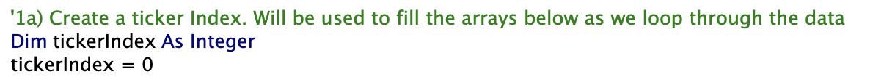 

2. Arrays for the ticker volume, ticker starting prices, and ticker ending prices are created. Data will be stored in these arrays as we loop through the data.

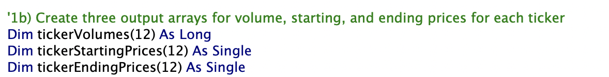 

3. The Volume for each ticker is initialized to 0. 

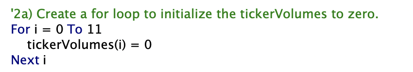 

4. We set the first ticker starting price. No matter what year the dataset is run on, we know that the first ticker price will be in the second row and 6th column (close). We need to do this becuase as we loop through the data we will set ticker starting price starting with the second one.

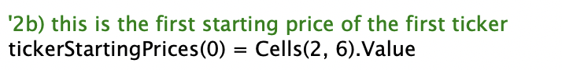 

5. In order to check that we are in the same ticker group, we need to create 2 variables that will store the ticker from the current row and the ticker from the next row. In doing this, we will identify when we are at the last row of the current ticker group.

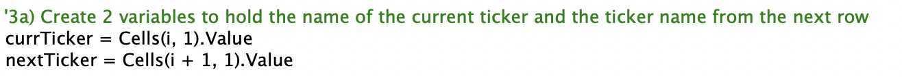 

6. If the current ticker value and ticker value in the next row match, all we need to do is increase the volume.

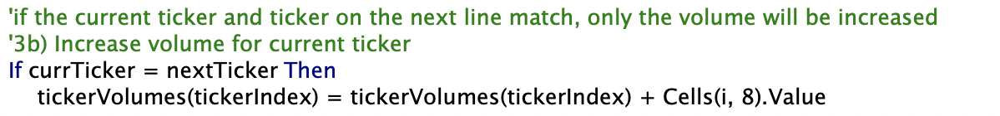 

7. If the current ticker is not the same as the ticker in the next row, then we are in the last line of the current ticker group. At this point, we will need to finish calculating/storing the data for the current ticker group.

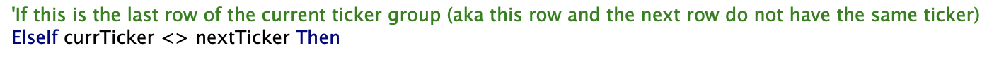 

8. Increase the volume for the current ticker

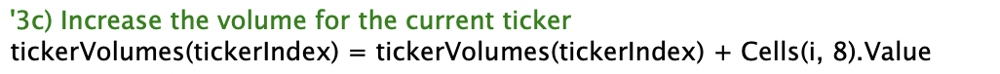 

9. Set the ending price for the current ticker and store it in the tickerEndingPrices array.

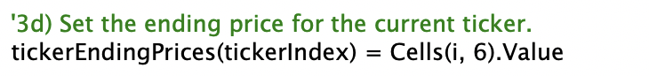 

10. Increase the ticker index by 1. This will allow you to store the ticker starting price for the next ticker group

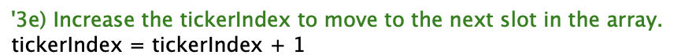 

11. Set the starting price for the next ticker group and store it in the tickerEndingPrices array.

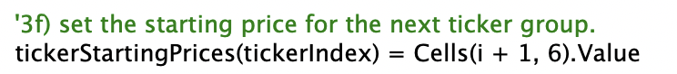 

12. Print the values that were stored in the arrays on the All Stocks Analysis worksheet.

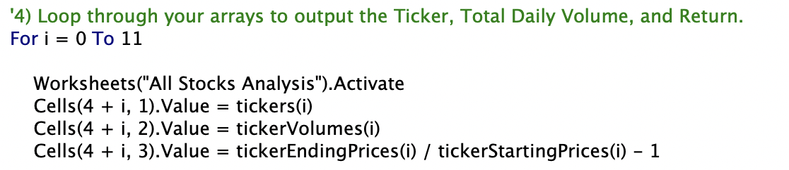 

### Performace Differences

## Summary
### Advantages and Disadvatages of Refactoring Code

### Applications to the original VBA Script
